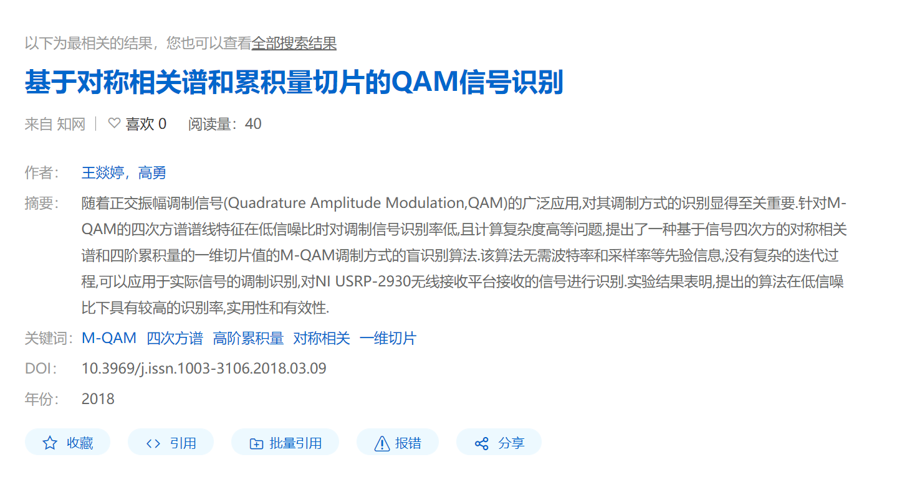
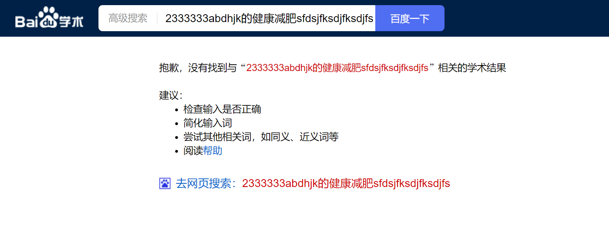

# 论文被引用数搜索

利用百度学术网页版来检索一个文件夹中的所有论文的被引用数量。

依赖有beautifulsoup库、regex正则表达式库。

## 使用方法

主程序为`fileWalk.py`。

修改程序中`workPath`值为文件夹绝对路径，如程序中所示，路径中所有区分符号使用`\\`，但路径末尾没有`\\`符号。

修改文件夹中所有论文文件名为`(论文题目).pdf`的样式，前后没有其他字符。

百度会限流，一般是30篇，所以有了`update.log`文件，其中保存的是已经更新的论文的名字，如果被限流了，等待大约10分钟后再试就可以直接跳过已经被更新的，将因被限流而没被更新的论文继续更新。

这样子可以大大节省时间，还是挺方便的。

后期根据我的需要添加增加作者名和发表时间的功能。

## 注意事项

- 文件夹中所有论文都会被修改，无论是根目录下的还是子文件夹中的
- 论文必须为pdf格式
- 文件命名为论文题目
- 文件名可以没有NTFS命名不允许的字符（:等），但不能将空格( )替换为下划线(_)
- 路径必须为绝对路径，或者前面包含`'.\\'`，否则无法识别

## 搜索有几种情况如下

如果无法看到图片可能需要修改一下DNS，github的图片展示好像不太行。

### 搜索结果有多篇论文

包括有多篇同名论文和没有同名论文的情况。

按第一篇的被引用数取。

### 搜索论文仅有一篇

若搜索后直接跳转到如下页面，则直接取该页面中的被引用数。

### 检索到论文但其中没有被引用数

直接返回-1，若原本文件没有被引头，则重命名为0。

### 没有搜索到论文

直接返回-1，重命名为0。

